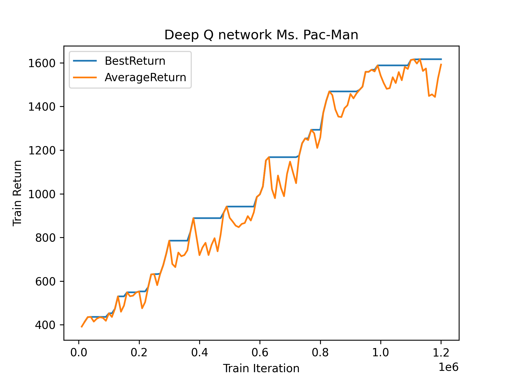
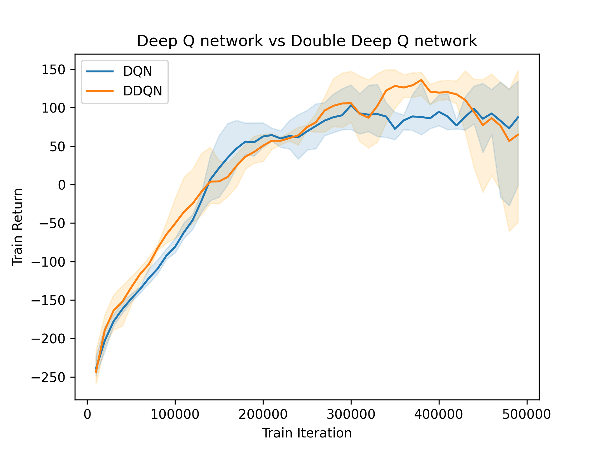
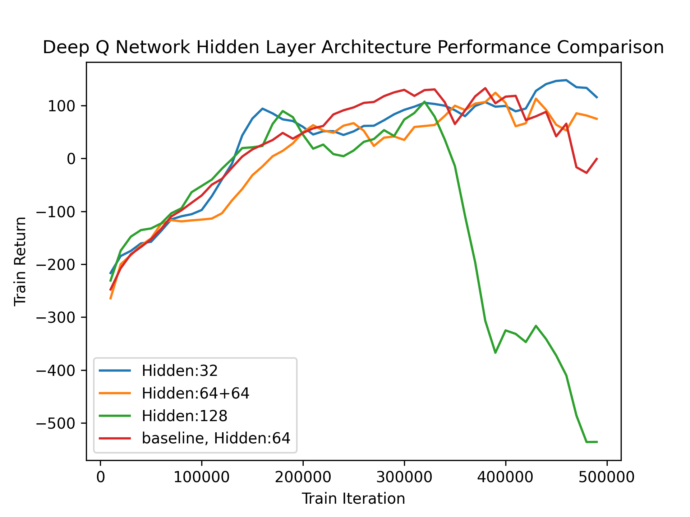
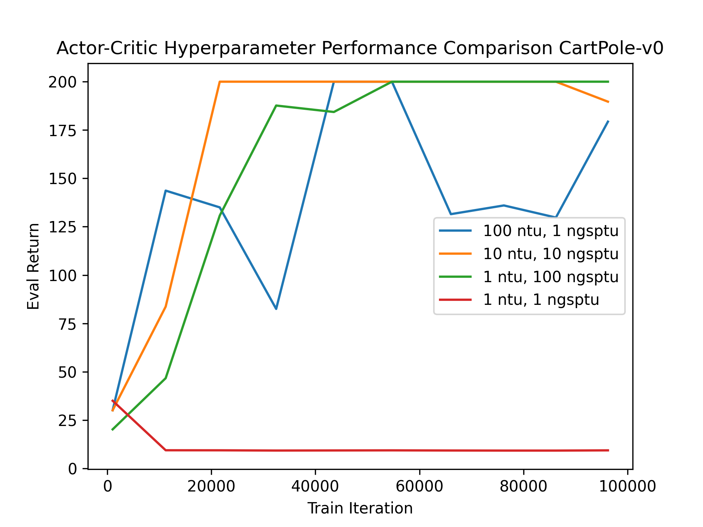
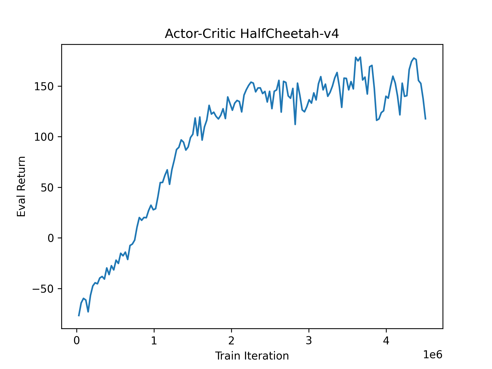
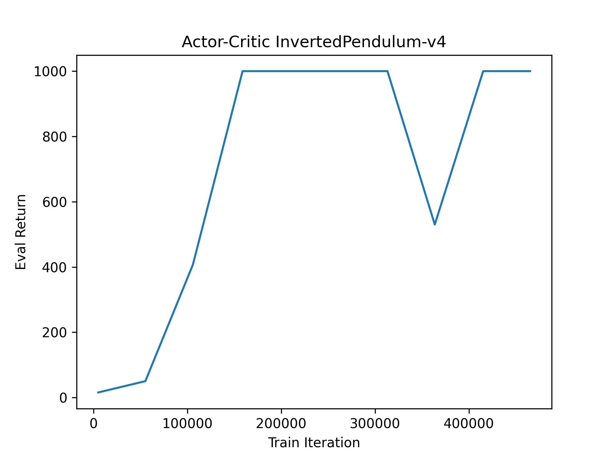
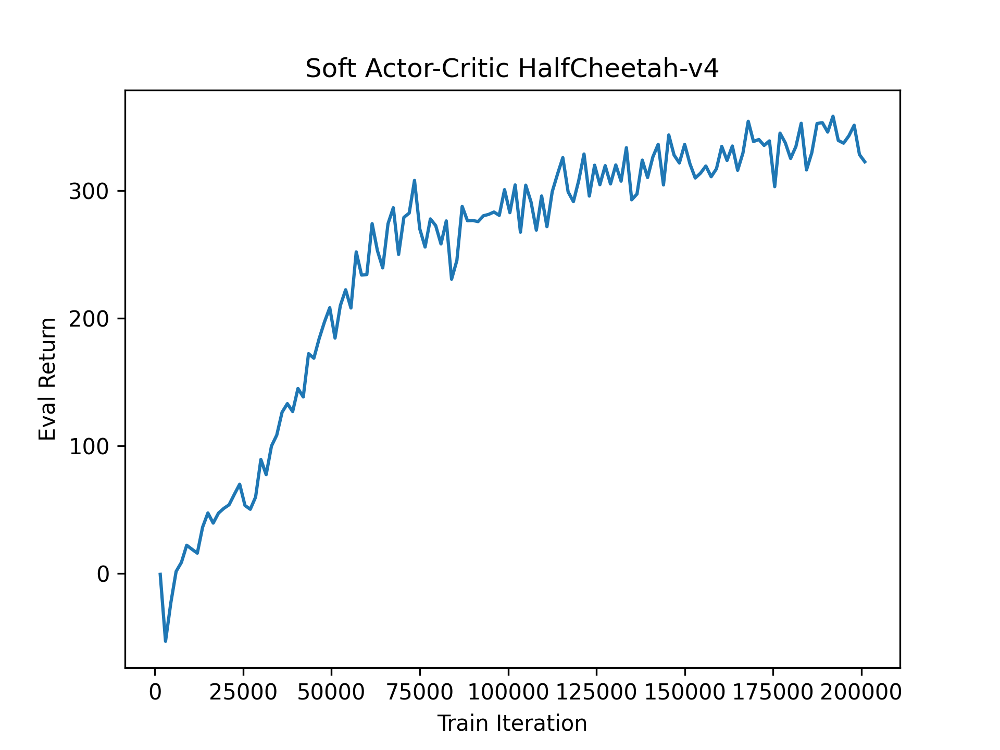
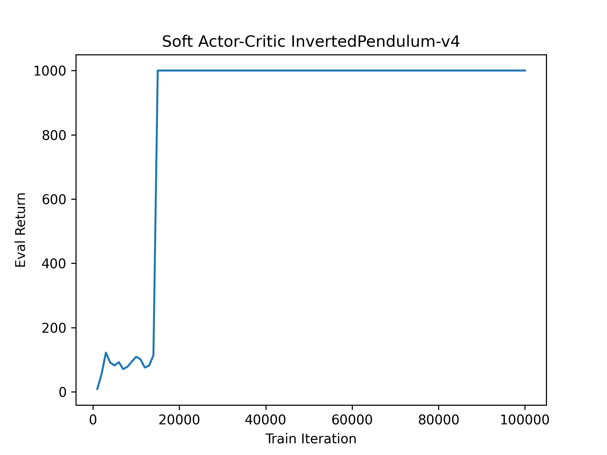

# CS285 HW3 Report

## Q1
Deep Q Network (DQN) performance on Ms. Pac-Man after 100,000 iterations.

 

## Q2
Performance of Double Q learning vs vanilla Q learning. It looks like the DDQN performs better on average than the vanilla Q learning. This is expected as double q learning tends to avoid over estimation and gives a better estimation to select actions.

 

## Q3
Effects of Q network architecture on DQN performance. I experimented with the hidden layer structure specifically to test the learning performance on LunarLander-V3. The results show that a smaller hidden layer tends to learn better with Q values. A larger hidden layer with 128 hidden nodes fell drastically after 300k iterations. This could be due to overfitting where the model fits to a specific state space and outputs trivial actions.

 

## Q4
Performance of Actor Critic Model on CartPole with different hyperparameter settings. From the graph, we can see that a more balanced iterational procedure helps the model to learn faster and stabler (10  target updates with 10 gradient step per target update), whereas naively iterate once as you go performs poorly. This is expected as we cannot expect the model to fully learn without enough gradient update. The number of target updates also helps with faster learning because we would like to keep our model as updated as possible.

 

## Q5 Actor Critic on more difficult tasks
HalfCheetah-V4            |  InvertedPendulum-V4
:-------------------------:|:-------------------------:
  |  

 

## Q6 Soft Actor Critic

HalfCheetah-V4            |  InvertedPendulum-V4
:-------------------------:|:-------------------------:
  |  