# CS285 HW5 Report

## Part 1 “Unsupervised” RND and exploration performance

Performance Compare
||Eval Average|
|--|--|
|Easy|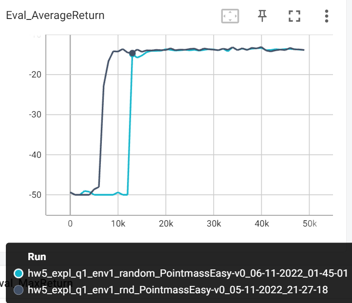|
|Medium|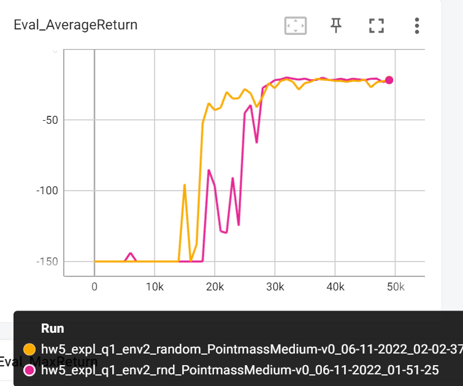|

State Density Comparison

||Random|RND|
|--|--|--|
|Easy|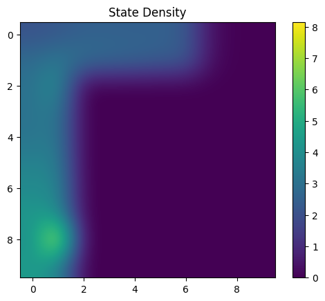||
|Medium|||

### Subpart Custom Exploration: Boltzman

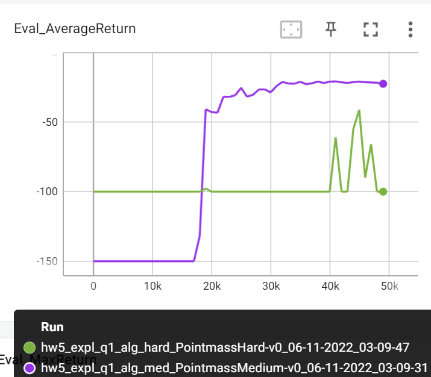

# Part 2 Offline learning on exploration data

## Subpart 1: Q value comparison
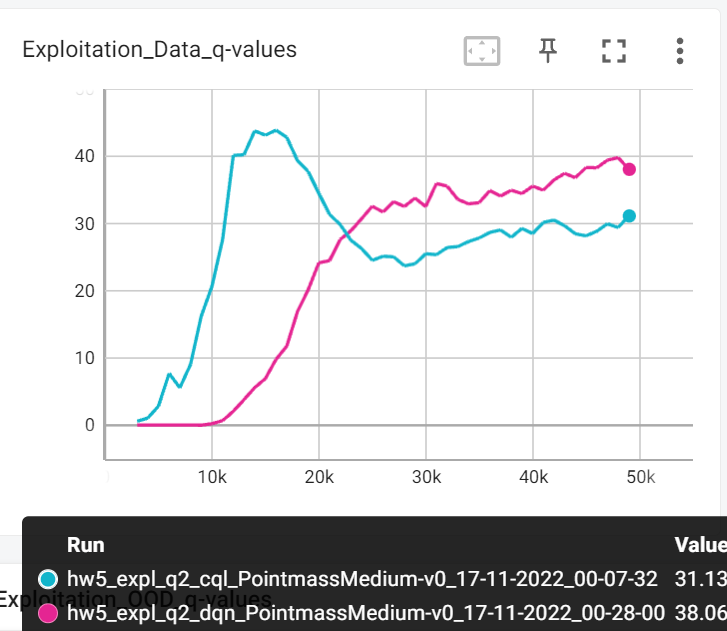

## Subpart 2 Numsteps comparison: 
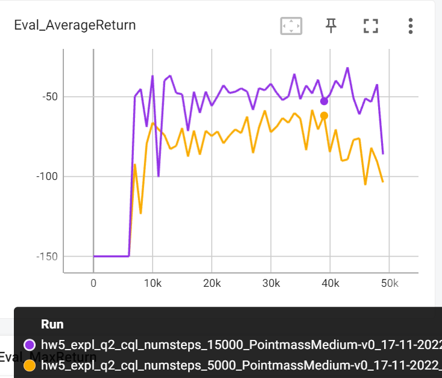

## Subpart 3: Alpha comparison:
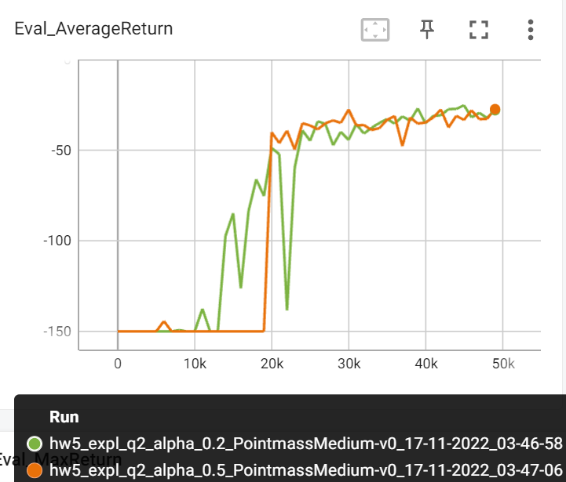

Alpha 0.2 performs the best while dqn performs the worst.

 

## Part 3 “Supervised” exploration with mixed reward bonuses.

### Compare to Q2(purely offline)
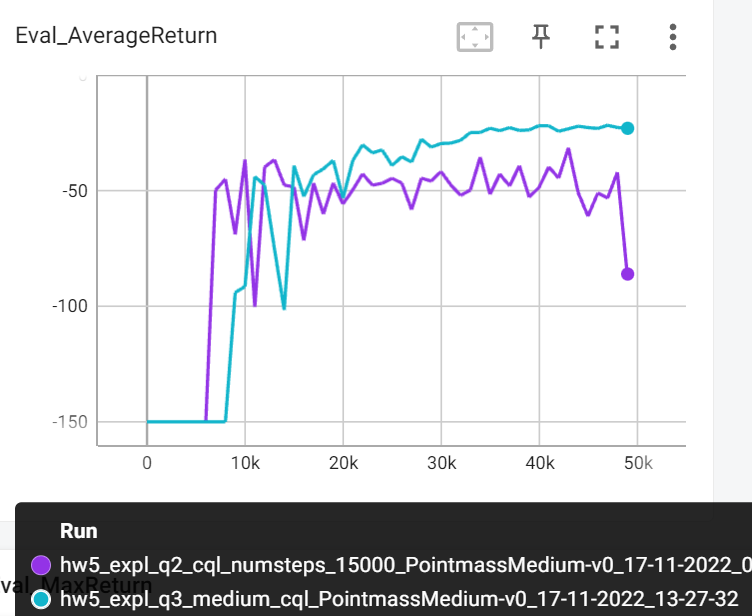
Clearly, mixed reward is the winner.

### Compare to Q1(rnd with default exploration=10000steps)
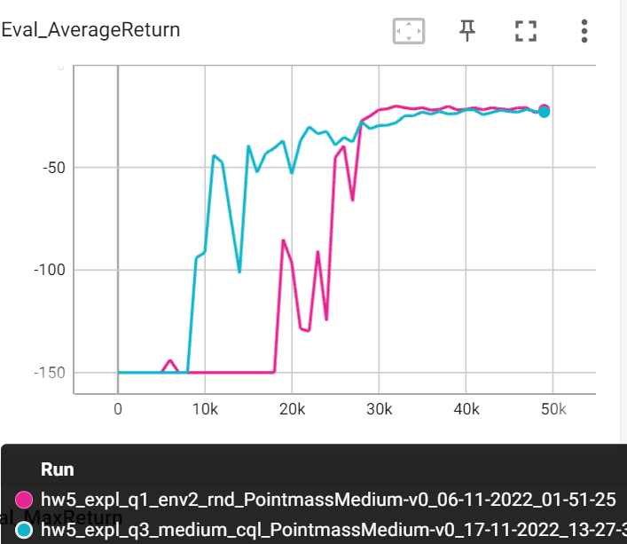
Even though the final result is close, but clearly CQL with mixed reward converges a lot faster than standard RND.

## Part 4 Offline Learning with AWAC 

||Supervised|Unsupervised|
|--|--|--|
|Easy|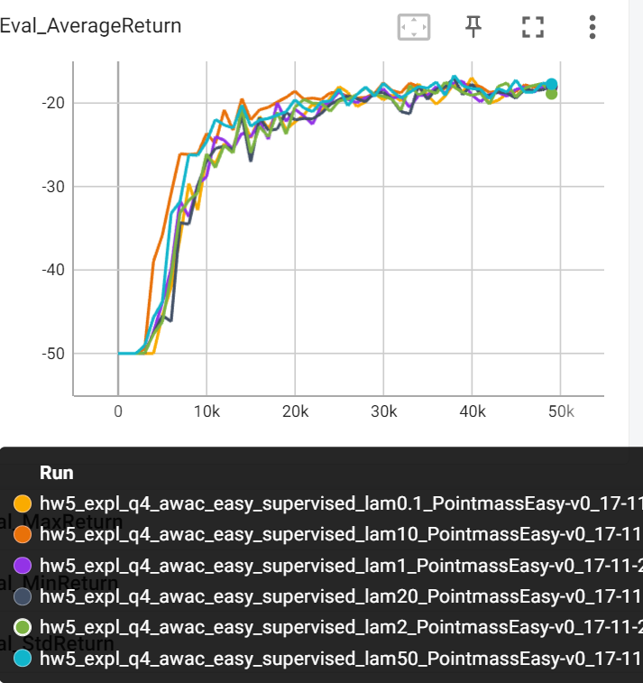|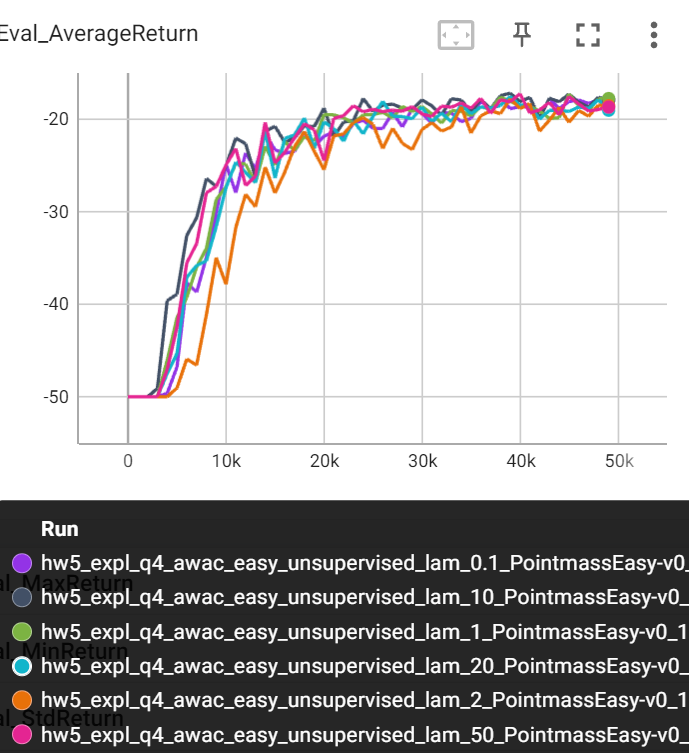|
|Medium|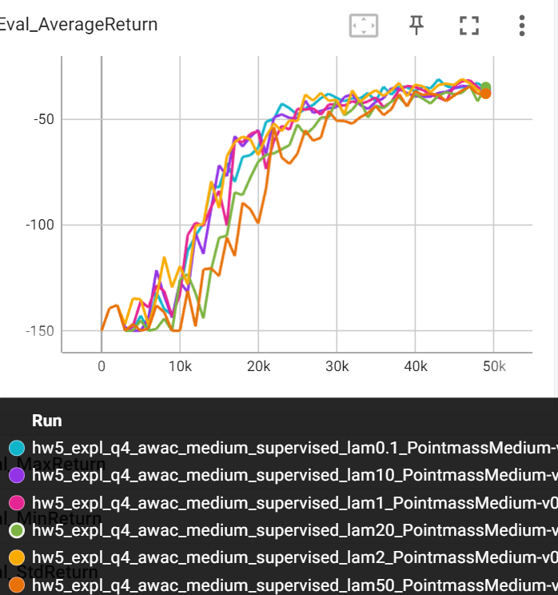|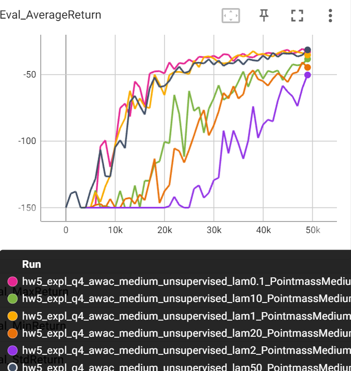|

Best lambda: Easy-sup(10), Easy-unsup(10), Med-sup(2), Med_unsup(0.1)

## Part 5 Offline Learning with IQL

||Supervised|Unsupervised|
|--|--|--|
|Easy|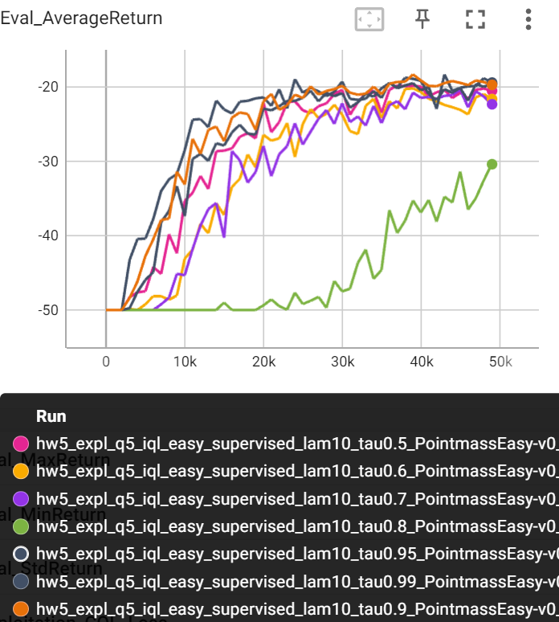|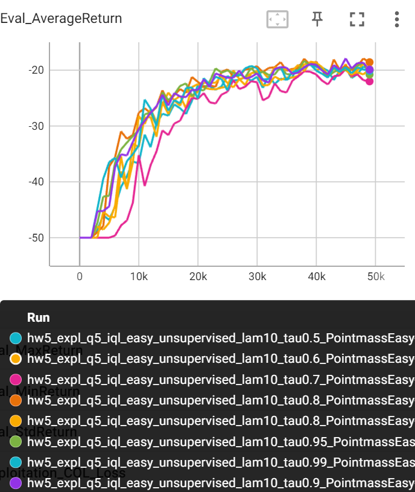|
|Medium||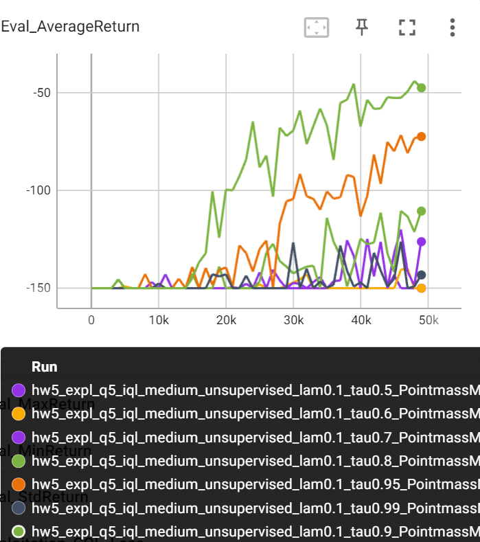|

Best tau: Easy-sup(0.99), Easy-unsup(0.8), Med-sup(0.9), Med_unsup(0.9)

### Final compare CQL, AWAC, IQL
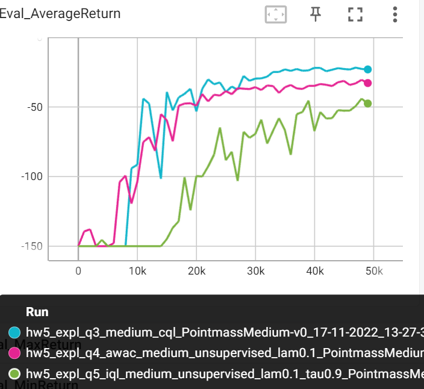

 

From the plot, we can see that cql seems to performs the best in the end. AWAC is also really close and converges fast. IQL seems to perform the worst among all.